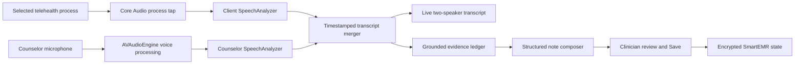

# SmartEMR Listener Roadmap

Date: 2026-07-14

Target hardware: MacBook Pro with M1 Pro and 16 GB RAM

Target operating system: macOS 26.5 initially

## Recommendation

Build Listener as a native, on-device pipeline inside SmartEMR:

1. Capture the selected telehealth process with a Core Audio process tap.
2. Capture the counselor microphone independently with AVAudioEngine.
3. Transcribe the two streams with separate Apple SpeechAnalyzer pipelines.
4. Merge finalized, time-indexed utterances into one transcript with explicit Counselor and Client labels.
5. Extract transcript-grounded clinical evidence incrementally.
6. Generate a complete session-note draft only for the appointment that started Listener.
7. Require clinician review before anything becomes part of the saved chart.

This path needs no BlackHole, virtual audio driver, helper application, Python runtime, local model server, or manual Audio MIDI Setup work. macOS will still show its required one-time Microphone, System Audio Recording, and Speech Recognition permission prompts. Those security prompts cannot and should not be bypassed.

## Nonnegotiable Safety Rules

- Listener creates drafts, never signed clinical records.
- Every capture session is permanently bound to a client ID, appointment ID, and Listener session ID at start.
- Changing the selected client or appointment in the UI cannot redirect transcript or note output.
- No assertion may enter a note unless it is traceable to transcript segments or an existing chart field deliberately supplied as context.
- Listener must not infer an unspoken suicide-risk denial, diagnosis, medication, intervention, mental-status finding, or medical-necessity statement.
- Missing information is marked as not discussed or left blank instead of being invented.
- Audio is not written to disk by default.
- Listener is unavailable unless the encrypted authenticated database is active. It must never fall back to localStorage for transcript data.
- The UI always shows a conspicuous Listening indicator and elapsed time.
- Starting requires a clinician confirmation that applicable recording and transcription consent has been obtained.

## Proposed Architecture

### Native integration

Create a Swift static library that is compiled and signed as part of SmartEMR. Do not create a helper executable or bundled setup tool.

The Swift layer owns:

- Core Audio process discovery and process taps.
- The temporary private aggregate audio device required by the tap.
- Microphone capture and voice processing.
- Audio conversion, timing, bounded buffers, and backpressure.
- SpeechAnalyzer and Foundation Models sessions.

The Rust/Tauri layer owns:

- Commands such as `listener_get_capabilities`, `listener_list_sources`, `listener_start`, `listener_pause`, `listener_resume`, `listener_stop`, and `listener_cancel`.
- Typed event delivery to the web UI.
- Session lifecycle checks and shutdown cleanup.
- Preventing App Nap while a session is actively listening.

Every event payload must contain:

- `listenerSessionId`
- `clientId`
- `appointmentId`
- `source` (`counselor` or `client`)
- `sequenceNumber`
- monotonic start and end times

The frontend must reject any event whose identity does not match the active Listener session.

## Audio Capture Design

### Client stream

Use a Core Audio `CATapDescription` to capture the output of the selected telehealth application or browser process. Group related audio processes by bundle identifier so browser utility-process restarts do not silently end capture.

Use a private, process-owned aggregate device and destroy it on stop, cancellation, crash recovery, or application exit. This is an internal Core Audio object, not an installed virtual audio driver.

Important limitation: Core Audio can isolate an application process, but not one Chrome or Safari tab. If a browser is selected, Listener captures all audio produced by that browser. The UI should warn the clinician and detect unrelated system or browser audio where possible.

### Counselor stream

Use AVAudioEngine to capture the selected microphone. Enable Apple voice processing where the active input/output route supports it. This provides acoustic echo cancellation and automatic voice processing without a third-party driver.

When the client plays through MacBook speakers, some client audio may still leak acoustically into the counselor microphone. Mitigations, in order:

1. Recommend headphones as the highest-confidence mode.
2. Enable Apple echo-cancelled input or AVAudioEngine voice processing when supported.
3. Compare the microphone and process-tap streams for correlated audio.
4. Flag or suppress near-identical transcript segments occurring on both streams, preferring the clean client stream.
5. Show a source-isolation warning instead of silently assigning uncertain speech.

### Audio format and buffering

- Capture at the hardware-native format.
- Convert to the format requested by SpeechAnalyzer, normally mono speech audio.
- Keep only bounded in-memory ring buffers needed for conversion and recovery from short processing stalls.
- Do not render video and do not use ScreenCaptureKit on the primary path.
- Batch UI updates so transcript rendering cannot block audio callbacks.
- Record explicit gap events if buffers overflow or a source disappears.

ScreenCaptureKit remains a fallback only if Core Audio process taps prove unreliable for a supported telehealth platform. It can capture system and microphone streams without a driver, but it is less targeted for this audio-only use case and uses Screen Recording permission.

## Realtime Transcription

Use two similarly configured SpeechAnalyzer instances with `SpeechTranscriber` time-indexed progressive transcription: one for Client and one for Counselor. Apple permits similarly configured transcribers to share backing engines and models, but two simultaneous long-running streams must be benchmarked on the M1 Pro before this becomes the final choice.

At startup:

- Check SpeechTranscriber availability and the English locale.
- Use AssetInventory to download and install the Apple-managed speech asset from inside the app if needed.
- Preheat both analyzers before the clinician starts the session.
- Do not begin a session unless both streams report healthy input.

Accuracy improvements:

- Build short contextual-term sets from the client's diagnosis, active goals, medications explicitly stored in the chart, clinician modality vocabulary, and a curated mental-health terminology list.
- Preserve volatile and finalized text separately so partial-result corrections replace prior text instead of duplicating it.
- Retain time ranges, alternatives, and confidence metadata while the draft is being reviewed.
- Highlight low-confidence clinical terms and names for clinician review.
- Normalize punctuation and speaker labels only after results become final.

Before selecting the production transcriber, compare:

1. SpeechTranscriber progressive transcription.
2. DictationTranscriber with contextual strings and a custom clinical language model.
3. A bundled native Whisper implementation only if Apple transcription misses the clinical accuracy gate.

A bundled Whisper model is a fallback, not the preferred design: it increases application size, memory pressure, power use, signing complexity, and update time.

## Clinical Evidence and Note Generation

Do not repeatedly ask a language model to rewrite the growing raw transcript. That becomes slower, less grounded, and eventually exceeds model context limits.

Instead, maintain an append-only evidence ledger from finalized transcript windows. Each evidence item contains source transcript segment IDs and one of these types:

- Client-reported symptoms, severity, frequency, duration, and change.
- Functional impact.
- Counselor interventions actually performed.
- Client response to interventions.
- Progress, barriers, and treatment-goal linkage.
- Objective observations supported by audio or explicit speech.
- Risk statements, including the exact question and response context.
- Medication statements.
- Homework and next-session plan.
- Scheduling or administrative material that should be excluded from the clinical note.

Use Apple Foundation Models guided generation for local structured extraction and drafting when available. Keep tasks small and schema-constrained. The on-device model is suitable for extraction and summarization, but it is not a source of clinical facts and must remain grounded in the evidence ledger.

The final draft should populate the existing appointment fields:

- Session Information.
- Symptom Pattern / Severity Context.
- Functional Impact.
- Progress / Response to Treatment.
- Medical Necessity Rationale, only when supported.
- SOAP Subjective.
- SOAP Objective.
- SOAP Assessment.
- SOAP Plan.
- Intervention Bank selections.
- Goal/objective progress references.
- Next Session notes when explicitly discussed.

The final composer should reuse the app's existing SOAP formatting, intervention-bank restrictions, suggestions, and clinician approval workflow. It should not maintain a second incompatible note format.

For users who explicitly choose cloud note generation, reuse the configured SmartEMR provider only after confirming the organization has the required agreement and policy. Send transcript text or the evidence ledger, never raw audio. The fully on-device path remains the default.

## User Experience

Add a Listener section to Session Information with:

- `Start Listening`.
- Telehealth source selector showing currently active audio applications.
- Microphone selector.
- Per-source level meters and health indicators.
- A clear consent confirmation.
- Counselor and Client transcript lanes with partial text visually distinguished from final text.
- Pause, Resume, Stop and Draft, and Cancel controls.
- A warning when the telehealth process, microphone, permission, or transcript engine is unavailable.
- A source-isolation warning when acoustic bleed or duplicate speech is detected.
- A post-session review showing low-confidence terms and every generated field before Save.

The app should automatically select the most recently used telehealth bundle and microphone, but it must show the selected sources before capture starts.

## Privacy, Security, and Retention

- Add `NSMicrophoneUsageDescription`, `NSAudioCaptureUsageDescription`, and `NSSpeechRecognitionUsageDescription` with plain-language explanations.
- Store consent confirmation, start/stop times, model versions, and transcript integrity metadata.
- Keep raw PCM only in bounded memory and clear buffers on stop.
- Encrypt transcript and draft state with the authenticated SmartEMR data key.
- Default to deleting the raw transcript after the clinician approves and saves the final note.
- Make transcript retention an explicit organization policy, not an accidental side effect.
- Never put transcript text, client names, audio samples, prompts, or model output into console logs, crash logs, or analytics.
- On lock, logout, account switch, or app quit, stop capture and finalize or securely discard the active session according to an explicit clinician choice.
- Require a HIPAA/security risk analysis before production use.
- Require legal review of state recording-consent requirements and organizational policy before rollout.
- Require a BAA before any cloud provider processes or stores transcript-derived ePHI.

## Delivery Roadmap

### Phase 0: Benchmarks and contracts (2-3 engineering days)

- Define typed Listener events, immutable chart binding, transcript segment schema, evidence schema, and draft schema.
- Create a de-identified scripted-session corpus with medication names, diagnoses, modalities, risk language, overlapping speech, silence, and poor network audio.
- Establish latency, accuracy, source-separation, resource, and hallucination baselines.
- Confirm Apple Intelligence and speech asset availability on the target Mac.

Exit gate: schemas and test corpus are reviewed before native capture code begins.

### Phase 1: Native dual-source capture (5-7 engineering days)

- Build the in-process Swift static library from scratch.
- Enumerate telehealth audio processes and microphones.
- Implement process tap, temporary aggregate device, microphone capture, timing, meters, pause/resume, and deterministic cleanup.
- Add permissions and clear setup diagnostics.
- Test built-in speakers, wired headphones, AirPods, browser process restart, route changes, sleep/wake, and app quit.

Exit gate: a 60-minute simulated session has no silent gaps or leaked temporary audio files, and both streams remain correctly labeled.

### Phase 2: Realtime two-stream transcription (5-8 engineering days)

- Integrate two SpeechAnalyzer pipelines.
- Add asset setup, preheating, final/volatile replacement, timestamps, confidence, alternatives, and source health.
- Add clinical vocabulary experiments and acoustic-bleed handling.
- Run Instruments profiling on the M1 Pro.

Exit gate: the chosen transcriber meets the agreed clinical-term, speaker-attribution, latency, and resource targets on the de-identified corpus.

### Phase 3: SmartEMR Listener UI and persistence (4-6 engineering days)

- Add source selection, consent, live transcript, controls, warnings, and review UI.
- Bind every action and event to immutable client/appointment/session identifiers.
- Add encrypted crash-recovery state for transcript text only, never raw audio.
- Ensure switching clients during capture cannot redirect any Listener output.

Exit gate: automated tests reproduce the prior cross-client race scenario and prove that no transcript or note can move to another chart.

### Phase 4: Grounded evidence and complete note drafting (7-10 engineering days)

- Implement incremental evidence extraction with transcript provenance.
- Implement local guided-generation schemas.
- Map evidence into Session Information, audit-proofing fields, SOAP, interventions, goals, and Next Session.
- Add low-confidence and unsupported-claim review.
- Preserve the existing provider path as an optional BAA-governed accuracy mode.

Exit gate: every generated clinical assertion has provenance, and adversarial tests produce zero fabricated risk, medication, diagnosis, or intervention statements.

### Phase 5: Reliability, privacy, and performance hardening (5-7 engineering days)

- Exercise permission denial/revocation, source loss, analyzer failure, network failure, low battery, thermal pressure, logout, lock, and app-update interruption.
- Verify no PHI appears in logs or unencrypted storage.
- Add retention controls and secure deletion behavior.
- Add long-session soak tests and updater/signing checks.

Exit gate: privacy checklist, failure-mode tests, and two-hour soak tests pass on the target Mac.

### Phase 6: Clinical validation and limited pilot (2-4 weeks)

- Use consented, de-identified role-play sessions first.
- Measure word error rate, clinical-term error rate, speaker attribution, unsupported-claim rate, clinician edit rate, and time saved.
- Have clinicians review risk, medication, diagnosis, intervention, medical-necessity, and goal-linkage behavior separately.
- Pilot with a small opt-in group before general release.

Exit gate: the clinician approves the measured accuracy and workflow, not merely the technical demonstration.

## Initial Acceptance Targets

These are targets to validate, not assumptions that the first prototype will meet:

- Partial transcript latency: 95th percentile under 1.5 seconds.
- Final transcript latency: 95th percentile under 3 seconds.
- No unreported audio gaps longer than 250 ms in a 60-minute session.
- Speaker attribution: at least 99% with headphones on the scripted corpus.
- Clinical-term recall: at least 95% on the curated test vocabulary.
- Unsupported high-risk facts: zero in the validation corpus.
- Generated claims with transcript provenance: 100%.
- Note ready for review: within 15 seconds after Stop and Draft.
- No raw audio files or PHI-bearing logs.
- No cross-client or cross-appointment writes under UI switching and concurrent-generation tests.

CPU, memory, power, and thermal budgets should be set after Phase 1 establishes an honest baseline on this M1 Pro. The goal is to keep capture callbacks lightweight, use OS-managed speech models, avoid video capture, bound all queues, and run note generation incrementally rather than continuously.

## Known Risks

- Browser taps capture the browser process, not one tab.
- Speaker playback can bleed into the microphone; headphones are the cleanest mode.
- Telehealth apps may change helper processes or audio routes during a call.
- Apple speech and foundation models can change with operating-system updates, so the test corpus must run against every supported macOS release.
- Medical vocabulary accuracy may require DictationTranscriber customization or an optional cloud transcription path if SpeechTranscriber misses the gate.
- Automatic notes can create serious clinical risk if unsupported statements are accepted without review.
- Recording-consent and psychotherapy-record rules vary by jurisdiction and organization.

## Primary Technical References

- Apple Core Audio taps: https://developer.apple.com/documentation/coreaudio/capturing-system-audio-with-core-audio-taps
- Apple CATapDescription: https://developer.apple.com/documentation/coreaudio/catapdescription
- Apple AVAudioEngine voice processing: https://developer.apple.com/documentation/avfaudio/avaudioionode/setvoiceprocessingenabled(_:)
- Apple SpeechAnalyzer: https://developer.apple.com/documentation/speech/speechanalyzer
- Apple SpeechTranscriber: https://developer.apple.com/documentation/speech/speechtranscriber
- Apple AnalysisContext: https://developer.apple.com/documentation/speech/analysiscontext
- Apple Foundation Models: https://developer.apple.com/documentation/foundationmodels
- HHS telehealth security guidance: https://www.hhs.gov/hipaa/for-professionals/privacy/guidance/hipaa-audio-telehealth/index.html
- HHS cloud and BAA guidance: https://www.hhs.gov/hipaa/for-professionals/special-topics/health-information-technology/cloud-computing/index.html
- HHS risk analysis guidance: https://www.hhs.gov/hipaa/for-professionals/security/guidance/guidance-risk-analysis/index.html
